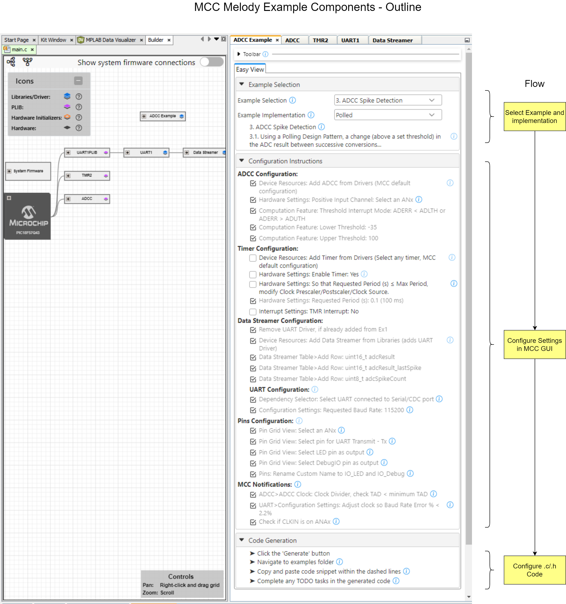
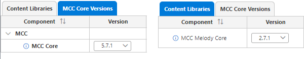
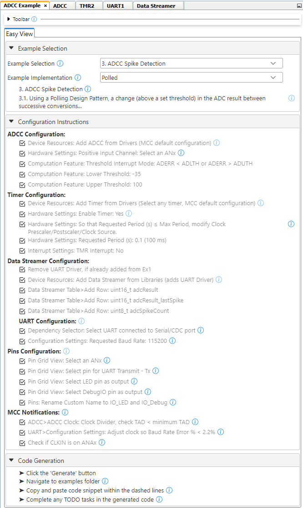
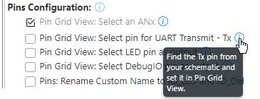
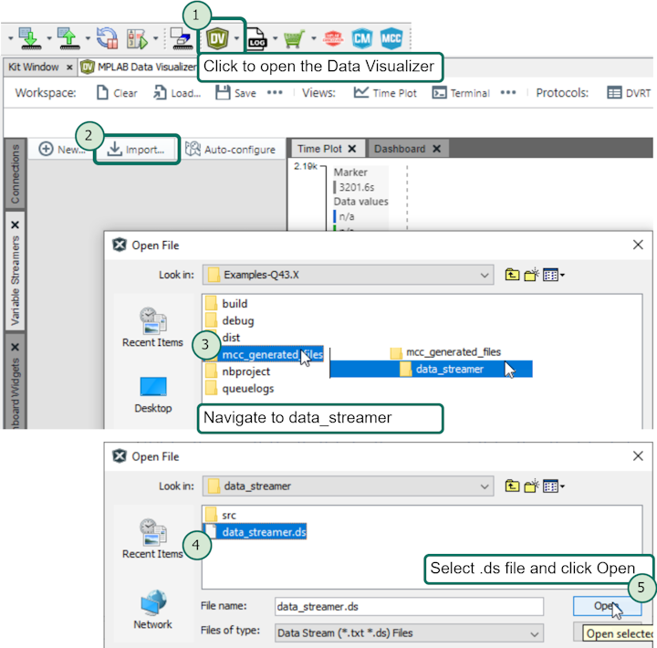
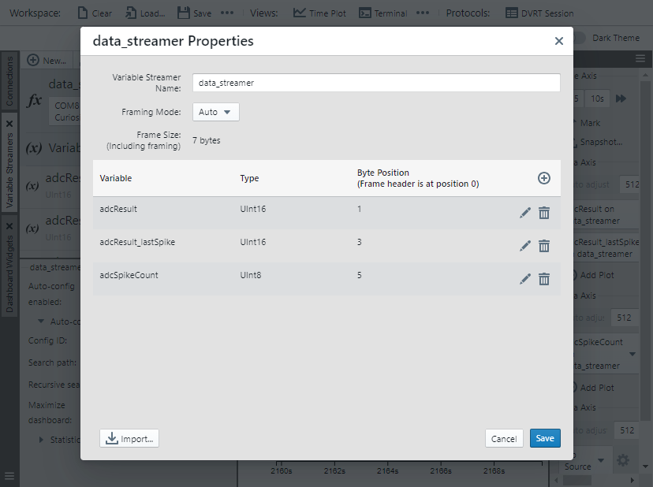
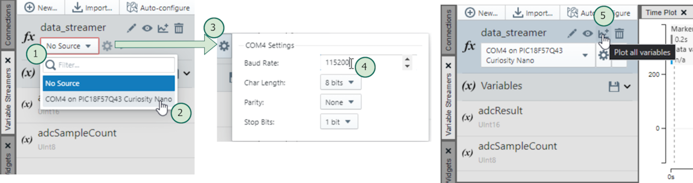
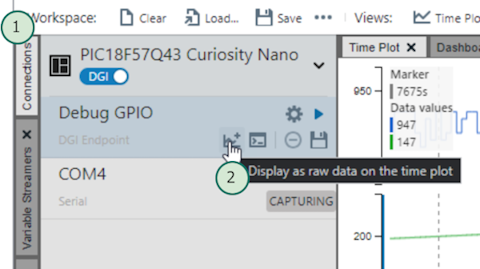

<a target="_blank" href="https://www.microchip.com/" id="top-of-page">
   <picture>
      <source media="(prefers-color-scheme: light)" srcset="images/mchp_logo_light.png" width="350">
      <source media="(prefers-color-scheme: dark)" srcset="images/mchp_logo_dark.png" width="350">
      
   </picture>
</a>

# MCC Melody ADC Spike Detection Example - Polled Implementation (PIC18F57Q43)

The [ADC Spike Detection Example](https://onlinedocs.microchip.com/v2/keyword-lookup?keyword=MCC.MELODY.EXAMPLES.RUNNING.ADCC.SPIKE&version=latest&redirect=true "Analog-to-Digital Conversion (ADC) Data Streamer example"), ADCC Spike Detection is visualized with the Data Streamer. The spike detection can be modified to observe the change in sensitivity, to the rate of change of the ADC samples. Using a Polling Design Pattern, a change (above a set threshold) in the ADC result between successive conversions represents a \"spike\". Every 100 ms delay starts an ADC conversion and sends a Data Streamer frame. The code continuously checks for a spike and updates the adcResult_lastSpike and adcSpikeCount when spikes are detected.

## MCC Melody Example Components
Example Components are a tight integration of learning material directly into MCC. This allows users to conveniently place configuration instructions side-by-side to the components they are configuring. For more information, refer to the [MCC Melody Example Components Introduction](https://onlinedocs.microchip.com/v2/keyword-lookup?keyword=MCC.MELODY.EXAMPLES&version=latest&redirect=true). 

**Note:** The image below shows the ADCC Example Component, as it would be moving to the ADCC Spike Detect Example - Callbacks implementation. A diff of what is needed to move to the Polled implementation is shown. 

**Note:** What is not shown is that the ADCC and UART interrupts need to be disabled.  

Complete projects, available in [MPLAB® Discover](https://mplab-discover.microchip.com) or GitHub, are specific to a board and microcontroller. However, the current project could be recreated on a range of supported microcontrollers by following the steps in the example component.

To explore what an example component is, as well as the difference between example and implementation, see [MCC Melody Example Components - The Basics](https://onlinedocs.microchip.com/v2/keyword-lookup?keyword=MCC.MELODY.EXAMPLES.BASICS&version=latest&redirect=true).

Example Components are related to [MCC Melody Design Patterns for Control Flow](https://onlinedocs.microchip.com/g/GUID-7CE1AEE9-2487-4E7B-B26B-93A577BA154E), which shows different standard ways to organize `main.c` and other application-level files, such as Polling, Interrupt and Callback, or State Machine Design Patterns. Users might be familiar with each of these patterns, but...
- What support does MCC Melody provide for each?
- What are the recommended ways of building on the MCC Melody generated code? 

## Software Used
- MPLAB® X IDE 6.20.0 or newer [(MPLAB® X IDE 6.20)](https://www.microchip.com/en-us/development-tools-tools-and-software/mplab-x-ide)
- MPLAB® XC8 2.46.0 or newer [(MPLAB® XC8 2.46)](https://www.microchip.com/en-us/tools-resources/develop/mplab-xc-compilers/xc8)

- MPLAB® Code Configurator (MCC) Plugin Version 5.5.1 or newer (*Tools>Plugins>Installed*, search: "MCC")
- ADC Converter with Computation (ADCC) Example Component 1.0.0 
- MCC Core 5.7.1 or newer 
- MCC Melody Core 2.7.1 or newer (Communicates with the MCC core, providing views and other functionality for MCC Melody)

  

## Hardware Used
- PIC18F57Q43 Curiosity Nano [(DM164150)](https://www.microchip.com/en-us/development-tool/DM164150)
- Curiosity Nano Explorer [(EV58G97A)](https://www.microchip.com/en-us/development-tool/EV58G97A)

## Setup
All instructions required to recreate this example are listed below, under Configuration Instructions.   

Once the project is loaded in MPLAB X IDE, the user will be able to find more information from Tooltips and links next to the instructions 
.

## Operation
The image below shows the [ADCC Basic Printf example](https://onlinedocs.microchip.com/v2/keyword-lookup?keyword=MCC.MELODY.EXAMPLES.RUNNING.ADCC.PRINTF&version=latest&redirect=true
) running, using the MPLAB Data Visualizer.

## Data Visualizer Configuration

1) Click the  icon to open the MPLAB Data Visualizer.
2) Under the **Variable Streamers** tab (on the left-hand side), click the  button, to import a `.ds` file.
3) From your project root, navigate into `mcc_generated_files/data_streamer/` directory.
4) Click the `data_streamer.ds` file to select it. 
5) Then click the  button to load the ds file.

The data_streamer Properties window will open up, displaying the loaded adcResult and adcSampleCount variables. 

1) Click the  button to load this data streamer configuration, for the ADCC Spike Detect Example. 

2) Click the  button.
3) Select your board from those available. 

   **Note:** If your board is not recognised by the MPLAB Data Visualizer, go to the Device Manager (Windows) to determine the COMx number.  

4) Click the  icon to bring up the COMx Settings. 
5) Set the baud rate to 115200, then click out of the window to close the settings. 
6) Click the  icon to plot all variables. 

1) Click the **Connections** button.
2) Under Debug GPIO, click the  icon to add to the time plot.

For more example components, open the stand-alone Content Manager  in MCC. 

 

